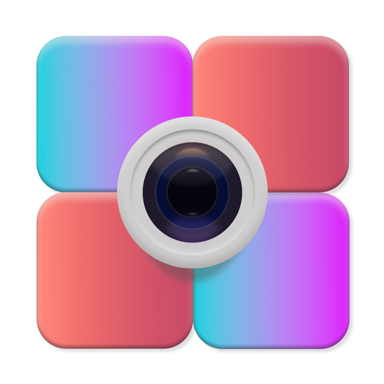

<h1 align="center">

Kamera
</h1>

<p align="center">
  
  <a href="https://github.com/besscroft/kamera/blob/master/LICENSE"></a>
  
</p>

一款专供摄影佬使用的记录网站，支持常见的图片格式，可以读取 EXIF 信息，管理维护图片，瀑布流展示查看图片。
兼容 S3 API、支持 CDN 配置。首页轮播图和精品照片展示，子页分类展示等功能。
基于 Nuxt3 开发，支持一键部署，无需单独后端。更多功能还在开发中~
今天又是想当二次元摄影高手的一天呢！

### 如何部署

你可以 Fork 后点击下面的按钮来一键部署到 Vercel

<a href="https://vercel.com/new/clone?repository-url=https%3A%2F%2Fgithub.com%2Fbesscroft%2Fkamera&env=Postgre_HOST,Postgre_PORT,Postgre_DATABASE,Postgre_USERNAME,Postgre_PASSWORD,AUTH_KEY,STORAGE_MODEL,KAMERA_USERNAME,KAMERA_PASSWORD"></a>

当然，如果你想部署到 Netlify 或者自部署也是可以的，只需要改一下预设即可 `nuxt.config.ts`：

```ts
nitro: {
  preset: 'vercel' // 可选 vercel、netlify、node-server，或者删除这一行，构建时也会自适应的。
}
```

#### 数据库

数据库请选择兼容 PostgreSQL 的数据库，我推荐 [SupaBase](https://supabase.com/)，它的每月免费额度足够个人使用了！
创建数据库后，将 `doc/sql/schema.sql` 导入到数据库执行。在 `Dashboard` 的 `Settings` 找到 `Database` 部分，你就能查看连接信息了。
当然，只要是兼容 pg 的数据库都是可以选择的，不必局限与某个平台。

> 请确保您的数据库用户配置了正确的 Row Level Security（行级别安全性）权限，否则将无法正常访问。

#### 环境变量

请在部署前设置您的环境变量，程序会去读这些值，用以更改构建步骤或函数执行期间的行为。

所有值都经过静态加密，并且对有权访问该项目的任何用户都可见。使用非敏感数据和敏感数据（例如令牌）都是安全的。**但请注意您自己不要泄露环境变量的值！**

如果您更改了环境变量，它不会影响当前的部署，您需要重新构建部署后才会生效！

受限于 Nuxt3 的局限性，某些设计可能不是特别人性化（主要还是懒），望理解！

> 请注意，平台部署请在平台控制台填写环境变量，会自动覆盖 `.env.production` 的值，以免发生机密信息泄露！
> 
> 项目内默认的 key 都是用作演示用途！

| Key              | 备注                                                                                              |
| ---------------- |-------------------------------------------------------------------------------------------------|
| Postgre_HOST     | Postgre 数据库主机，如：db.kamera.supabase.co                                                           |
| Postgre_PORT     | Postgre 数据库端口，默认值：5432                                                                          |
| Postgre_DATABASE | Postgre 数据库名称，默认值：postgres                                                                      |
| Postgre_USERNAME | Postgre 数据库用户名，默认值：postgres                                                                     |
| Postgre_PASSWORD | Postgre 数据库密码，默认值：postgres                                                                      |
| AUTH_KEY         | 权限 key，jwt 和 hash 都需要用到它。如果您更改了它，请自行生成新密码，默认值：kamera                                                                         |
| AccessKey_ID     | 阿里 OSS / AWS S3 AccessKey_ID                                                                    |
| AccessKey_Secret | 阿里 OSS / AWS S3 AccessKey_Secret                                                                |
| Region           | 阿里 OSS / AWS S3 Region 地域，如：oss-cn-hongkong                                                     |
| Endpoint         | 阿里 OSS / AWS S3 Endpoint 地域节点，如：oss-cn-hongkong.aliyuncs.com                                    |
| Bucket           | 阿里 OSS / AWS S3 Bucket 存储桶名称，如：kamera                                                           |
| STORAGE_FOLDER   | 存储文件夹，严格格式，如：kamera 或 kamera/images ，填 / 或者不填表示根路径                                              |
| CDN_URL          | CDN 域名，请严格按照 example.com 格式，不需要添加 https:// 会自动补充，如：kamera-s3-cdn.heming.dev                     |
| STORAGE_MODEL    | 存储模式：本地维护填 local / 对象存储填 s3。选本地的话，就会从 assets/server 下加载 json 文件，你需要手动维护；选对象存储，通过后台功能进行维护。默认值：s3 |
| KAMERA_USERNAME  | 系统用户账号，默认值：admin，单次登录有效期 24 小时。                                                                 |
| KAMERA_PASSWORD  | 系统用户密码，默认值(666666)，如果需要更改密码，可在登录后进入后台自行生成后替换。                                                   |

> 理论上存储兼容 AWS S3 API，除了阿里云 OSS 外，其它兼容 S3 API 的存储都可以使用。

#### 页面配置

我们支持自定义相册页面的标题和链接，当然也是支持多个相册页面的。
你需要在 `constants\photos.json` 文件中，进行如下配置：

```json
[
  {
    "title": "Cosplay",
    "url": "/cosplay"
  },
  {
    "title": "集邮",
    "url": "/tietie"
  },
  {
    "title": "时光相册",
    "url": "/timeline"
  }
]
```

顾名思义，`title` 和 `uel` 对应的就是页面标题和页面地址，如果您想正常使用的话，还请照葫芦画瓢，而不是乱填。

> 每配置一个页面，都会对应的增添一个图片类别选项，在您的对象存储中，也会增加对应的文件夹。
> 
> 同时也会被配置成 `pre-rendered`，从而在某些情况下加快 `Hydration`，带来更快的页面加载，以及更好的 SEO。 
> 
> 注意添加的页面，别忘了配置白名单哦！

#### 白名单配置

我们提供了客户端路由中间件和服务端接口中间件，默认情况下你不需要管，但如果你想自定义白名单，这里提供了配置方案。
在 `app.config.ts` 文件中，可以看到如下默认配置：

```ts
export default defineAppConfig({
    noLoginPageWhiteList: [
        '/',
        '/login',
        '/tietie',
        '/cosplay',
        '/timeline',
        '/about',
        '/error',
    ],
    loginPageWhiteList: [
        '/admin',
        '/admin/list',
        '/admin/system',
    ],
    apiWhiteList: [
        '/api/login',
        '/api/verify',
        '/api/music',
        '/api/getImageList',
    ]
})
```

> `noLoginPageWhiteList` 对于客户端路由中间件和服务端接口中间件来说，不需要登录就能访问的页面。
> 
> `loginPageWhiteList` 对于客户端路由中间件来说，需要 token 才能访问；对于服务端接口中间件来说，必须要填写才能访问的页面。
> 
> `apiWhiteList` 不需要 token 就能访问的接口。

#### 网站配置

在 `constants/index.ts` 文件，可以配置：

| Key              | 备注                          |
| ---------------- |-----------------------------|
| appName     | 网站标题                        |
| appDescription     | 网站描述                        |
| copyright | 版权声明作者名称，如“Bess Croft”，显示为：© 2023 Bess Croft 版权所有. |

> 虽然您可以修改源码再部署，但我们希望您能保留 Made with 和 GitHub 仓库地址。

### 在线开发

你可以使用 Gitpod 进行在线开发：

<p><a href="https://gitpod.io/#https://github.com/besscroft/kamera" rel="nofollow"></a></p>

或者克隆到本地开发:

```shell
git clone https://github.com/besscroft/kamera.git

pnpm i

pnpm run dev
```

如果您有任何建议，欢迎反馈！

### 代码贡献

[提出新想法 & 提交 Bug](https://github.com/besscroft/kamera/issues/new) | [Fork & Pull Request](https://github.com/besscroft/kamera/fork)

Kamera 欢迎各种贡献，包括但不限于改进，新功能，文档和代码改进，问题和错误报告。

> 有需求和建议都可以提，有空的话我会处理，但受限于 Nuxt3 / SSR 的⌈局限性⌋，很多功能的设计上可能会有取舍。

### 隐私安全

您使用本程序时，需要自己去维护各个平台的配置信息（毕竟跟咱没关系，需要在对应的平台配置），以及对象存储的读写权限、访问控制、防盗链、跨域设置、缓存策略和 CDN 等配置，以最大程度的避免天价账单。

我们采用了 [Sentry](https://github.com/getsentry/sentry) 来追踪错误信息，以便改进程序。会话重播 SDK 会屏蔽所有 DOM 文本内容、图像和用户输入，让您更加确信敏感数据不会离开浏览器。

如您有更多疑问，可以提交 [Issue](https://github.com/besscroft/kamera/issues/new)。

### 感谢

本项目使用 JetBrains 的开源许可证，基于 IntelliJ IDEA 开发，感谢！


### License

Kamera is open source software licensed as [MIT](https://github.com/besscroft/kamera/blob/main/LICENSE).

